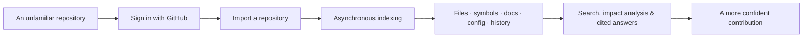
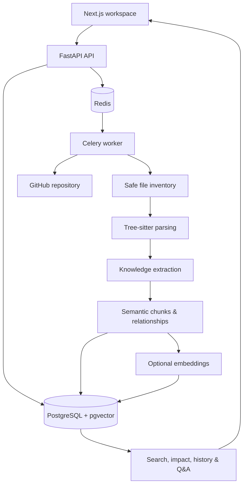

# CoDNA

> **Understand a codebase before you change it.**

CoDNA is an AI-powered repository intelligence workspace for the moment every developer knows: you open an unfamiliar project, want to contribute something useful, and realize the real task is first understanding how the system thinks.

## Inspiration

The idea for **CoDNA** began while we were exploring the [Sharp](https://github.com/lovell/sharp) repository for image processing. One teammate wanted to understand how the library worked internally. We did what most developers do: opened files, followed imports, searched for function names, and asked ChatGPT and other AI tools for help.

Those tools were useful for explaining a function or a file. But understanding the repository as a whole was slow, repetitive, and surprisingly lonely. Each follow-up meant supplying more context. Every answer led to another file, another call path, another piece of history, and another question about *why* the code was arranged that way.

That experience felt especially familiar from our early open-source contributions. The difficult part was rarely writing a few lines of code. It was spending hours building enough context to make a safe change without breaking an assumption we had not discovered yet.

So we asked ourselves:

> **What if an AI could understand a repository more like an experienced maintainer—not as disconnected snippets, but as a connected system?**

That question became CoDNA.

## What CoDNA does

CoDNA turns a GitHub repository into a navigable body of evidence. It indexes source structure, documentation, configuration, relationships, and accessible GitHub history so a contributor can investigate a codebase before changing it.

Instead of treating a repository as a pile of plain text, CoDNA combines:

- graph-based code relationships and impact traversal;
- symbol-level parsing of supported source languages;
- hybrid lexical and vector-aware retrieval;
- incremental indexing for changed files; and
- evidence-grounded AI answers with citations when an AI provider is configured.

After importing a repository, developers can investigate questions such as:

- How does authentication work here?
- Where is this API configured?
- What calls or depends on this symbol?
- Which files could be affected if I change this module?
- What does this part of the architecture do, and what evidence supports that explanation?

The goal is not to replace careful engineering judgment. It is to reduce the time spent hunting for context so contributors can spend more time reasoning, reviewing, and shipping a meaningful change.

## The contributor journey



## How we built it

CoDNA is a full-stack repository-understanding platform. The browser stays responsive while an asynchronous worker processes the imported repository, and the resulting evidence is stored for exploration, retrieval, and questions.



### Backend

- FastAPI, Pydantic, SQLAlchemy, and Alembic
- PostgreSQL with pgvector for durable repository intelligence data
- Redis and Celery for durable, asynchronous indexing work
- GitHub OAuth and GitHub API integration

### Frontend

- Next.js 16 and React 19
- TypeScript and Tailwind CSS
- Dashboard, repository explorer, history, chunks, and search/Q&A views

### Repository intelligence

- Shallow cloning and safe file discovery
- Tree-sitter parsing for Python, JavaScript, JSX, TypeScript, and TSX
- Structured extraction from source code, Markdown, Prisma schema, package metadata, Python metadata, TypeScript config, Dockerfiles, and Compose files
- Repository-aware semantic chunks with stable IDs, source ranges, and resolved local relationships where unambiguous
- Incremental re-indexing of changed files and their affected chunks
- Optional embedding generation, hybrid retrieval, cited Q&A, and graph-backed impact analysis

## What is implemented

| Capability | What it means in CoDNA |
| --- | --- |
| GitHub OAuth | Contributors authenticate with GitHub and discover repositories they are allowed to access. |
| Ownership-safe import | Repository records and all exploration routes are scoped to the authenticated CoDNA user. |
| Background indexing | A durable job queues cloning and analysis without making the UI wait. |
| Safe inventory | Noisy or risky paths—dependency folders, VCS data, build output, symlinks, secret-like env files, and oversized files—are excluded. |
| Source mapping | Parsed imports, symbols, signatures, and source ranges make the codebase easier to inspect. |
| Knowledge extraction | Source, docs, schema, and configuration become structured repository facts. |
| Search and questions | Retrieval can use embeddings when configured; answers are constrained to indexed repository evidence and include citations. |
| Impact and history | APIs support relationship graph traversal, change-impact exploration, and accessible commits, pull requests, and issues. |

## Challenges we worked through

Building CoDNA became much more than connecting an LLM to GitHub.

- **A repository is not one document.** The worker must safely inventory, parse, and connect many different kinds of files before a useful answer is possible.
- **Relationships need humility.** Imports, calls, references, inheritance, and exports are only resolved when the evidence is unambiguous; uncertain links are left unresolved rather than invented.
- **Good answers need boundaries.** Retrieval, graph traversal, source ranges, and citations give the answering layer evidence to work from instead of asking it to summarize an entire repository from memory.
- **Indexing has to respect time and cost.** Changed files are reprocessed incrementally; embeddings run separately so the repository remains explorable if a provider is unavailable.
- **The first contributor still needs a clear path.** OAuth, repository ownership, job status, and a visible explorer turn a complex backend pipeline into a usable product journey.

## What we are proud of

- We built a repository pipeline that moves beyond file-by-file explanations: it connects source structure, documentation, configuration, chunks, relationships, history, and retrieval in one workspace.
- We designed CoDNA around evidence. A response should point back to repository material, and impact exploration follows stored relationship paths rather than a generic guess.
- Repository analysis is asynchronous, and incremental updates avoid needless reprocessing of unchanged files.
- We kept the original human problem in view: helping someone feel less lost when they open an unfamiliar codebase for the first time.

## Documentation and technical detail

The project documentation is intentionally close to the product, not an afterthought:

- [End-to-end setup](SETUP.md)
- [API reference](docs/API.md)
- [Repository indexing pipeline](docs/ASYNC_INDEXING.md)
- [Architecture](docs/ARCHITECTURE.md)
- [Repository import and ownership](docs/REPOSITORY_REGISTRATION.md)
- [Repository inventory details](docs/REPOSITORY_INVENTORY.md)
- [Future plan](docs/FUTURE_PLAN.md)

## Demo path for judges

1. Open the landing page and choose **Continue with GitHub**.
2. Import a repository available to the authenticated GitHub account.
3. Start indexing and show the job progress instead of waiting on a blocking page.
4. Explore the repository’s files, parse results, extracted knowledge, semantic chunks, and history artifacts.
5. Search for a focused concern, such as authentication or API configuration.
6. With provider credentials configured, ask a repository question and inspect the citations; use impact controls to narrow a change investigation.

## Security and responsible access

- GitHub OAuth credentials and GitHub access tokens remain server-side; API responses expose CoDNA’s session token rather than the GitHub token.
- Repository queries verify ownership for the authenticated CoDNA user.
- The discovery layer skips sensitive-looking environment files and unsafe/noisy paths before indexing.
- Private repositories use the contributor’s server-stored GitHub authorization only when it is needed for cloning or history retrieval.
- Never commit `.env` files, OAuth credentials, JWT secrets, or provider API keys.

## Project layout

```text
CoDNA/
├── apps/
│   ├── web/                  # Next.js contributor workspace
│   └── api/                  # FastAPI modules, migrations, and tests
├── infra/docker/             # Worker container definition
├── docs/                     # API, architecture, pipeline, and operating notes
├── docker-compose.yml        # Local web, API, worker, PostgreSQL, and Redis stack
└── SETUP.md                  # End-to-end local setup guide
```

## Verification

The backend test suite covers repository cloning, discovery, parsing, knowledge extraction, chunks, retrieval, graph traversal, repository questions, GitHub discovery, and asynchronous indexing.

```bash
docker compose run --rm api pytest
```

For local frontend checks:

```bash
npm install
npm run typecheck --workspace web
npm run lint --workspace web
```

## What we learned

This project taught us that repository understanding is more than vector search. Language models become much more helpful when they can reason over structured relationships, precise source locations, and curated evidence instead of isolated snippets.

It also made the engineering trade-offs tangible: how to run long analysis safely in the background, how to preserve ownership boundaries, how to avoid reprocessing unchanged work, and how to make an AI answer honest about the evidence it has.

## What is next

We are just getting started. The roadmap includes broader language support, richer relationship resolution, interactive architecture visualization, refresh controls, PR-impact workflows, stronger operational limits, and production hardening.

An especially important next step is an IDE extension—bringing CoDNA into the editor in the same spirit as modern in-editor coding assistants such as Codex. Rather than forcing developers to leave their workflow, an extension could surface repository-aware search, impact paths, history, and evidence-backed questions beside the file they are already reading. That would make CoDNA more immediate, more useful during implementation and review, and better suited to the everyday work of contributing to a large codebase.

The long-term vision is simple: make CoDNA feel like an AI teammate that helps developers understand a repository deeply enough to contribute with confidence—so they spend less time lost in code and more time building something valuable.
