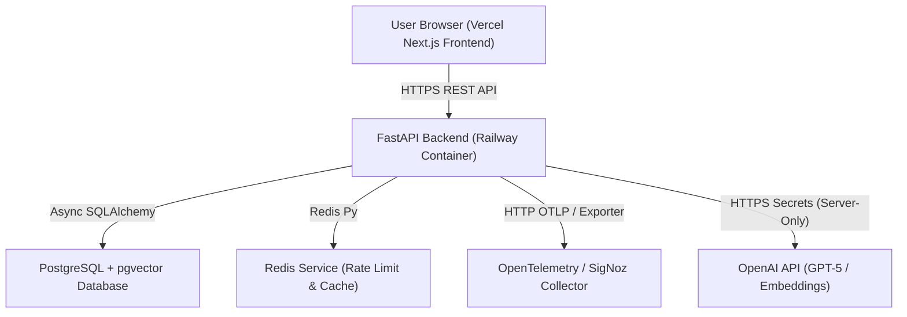

# 🚀 CoDNA Deployment & Infrastructure Reference Guide

This comprehensive guide documents the full-stack architecture, deployment process, environment variables, security controls, and cloud provider migration procedures for **CoDNA**.

---

## 🏛️ System Architecture Overview

CoDNA is designed as a decoupled, 12-factor cloud application:



### Stack Components:
1. **Frontend (`apps/web`)**: Next.js 16 (Turbopack, TypeScript, Vanilla CSS). Hosted on **Vercel**.
2. **Backend (`apps/api`)**: Python 3.11 FastAPI (Uvicorn, Async SQLAlchemy, Pydantic). Hosted on **Railway** via `apps/api/Dockerfile`.
3. **Database**: Managed PostgreSQL 16 with `pgvector` vector similarity search extension. Auto-initialized on startup.
4. **Cache / Rate Limiter**: Redis server for per-repo question throttling and session caching.
5. **Observability**: OpenTelemetry SDK auto-instrumentation streaming logs, traces, and metrics to SigNoz OTLP Collector over HTTP (`:4318`).

---

## 🔑 Environment Variables Matrix

### 1. Railway Backend (`codna-api` Service)

| Variable Name | Required? | Example Value | Description |
| :--- | :--- | :--- | :--- |
| `DATABASE_URL` | **Yes** | `${{Postgres.DATABASE_URL}}` | Dynamic reference to Railway PostgreSQL connection string |
| `REDIS_URL` | **Yes** | `${{Redis.REDIS_URL}}` | Dynamic reference to Railway Redis instance |
| `OPENAI_API_KEY` | **Yes** | `sk-proj-...` | Server-only OpenAI key for vector embeddings & Q&A generation |
| `APP_NAME` | Optional | `CodeDNA API` | Application identifier (default: `CodeDNA API`) |
| `APP_VERSION` | Optional | `0.1.0` | App version tracking (default: `0.1.0`) |
| `APP_ENV` | Optional | `production` | Environment tier (`production` / `development`) |
| `LOG_LEVEL` | Optional | `INFO` | Logging level (`DEBUG`, `INFO`, `WARNING`, `ERROR`) |
| `QUESTION_RATE_LIMIT_PER_REPO` | Optional | `1` | Max question limit per repository IP for public visitors |
| `ANSWER_BUDGET_USD` | Optional | `1.00` | Max total budget cap across all LLM question calls |
| `FRONTEND_URL` | Optional | `https://co-dna-web.vercel.app` | Allowed CORS origin for production frontend |
| `GITHUB_CLIENT_ID` | Optional | `Ov23...` | GitHub OAuth App Client ID |
| `GITHUB_CLIENT_SECRET` | Optional | `a83b...` | GitHub OAuth App Client Secret |
| `GITHUB_CALLBACK_URL` | Optional | `https://co-dna-web.vercel.app/auth/callback` | OAuth redirect callback URI |
| `JWT_SECRET` | Optional | `your_secret_string_123` | Secret key for signing user authentication tokens |
| `OTEL_ENABLED` | Optional | `false` | Set `false` to disable OpenTelemetry trace export logging |

---

### 2. Vercel Frontend (`co-dna-web` Project)

| Variable Name | Required? | Example Value | Description |
| :--- | :--- | :--- | :--- |
| `NEXT_PUBLIC_API_URL` | **Yes** | `https://codna-api-production.up.railway.app` | Public backend URL (Must include `https://`) |
| `NEXT_PUBLIC_DEMO_MODE` | Optional | `false` | Enables read-only judge mode when set to `true` |

> 🔒 **Security Guarantee**: `OPENAI_API_KEY` lives exclusively inside Railway backend environment. It is **never** sent to Vercel or exposed to client browsers.

---

## 🛡️ Public Demo Rate Limiting & Spending Controls

To prevent public key misuse while serving live hackathon/demo traffic:

1. **Per-Repository Rate Limit (`QUESTION_RATE_LIMIT_PER_REPO=1`)**:
   - Backend Redis tracks question counts per IP per repository ID.
   - When exceeded, backend returns a friendly HTTP 429 response. The UI renders a stylized callout box guiding users to `SETUP.md` or contact email (`ashutoshbadapanda02@gmail.com`).
2. **Cumulative Budget Cap (`ANSWER_BUDGET_USD=1.00`)**:
   - CoDNA tracks cumulative token cost for answers. When budget hits `$1.00`, LLM execution stops safely.
3. **OpenAI Platform Hard Limit**:
   - In OpenAI Dashboard (Limits page), set a hard monthly cap of `$1.00`.

---

## 🔄 Database Auto-Initialization & Migration Safety

On application startup, FastAPI `lifespan` automatically executes:
```python
async with app.state.db_engine.begin() as conn:
    await conn.execute(text("CREATE EXTENSION IF NOT EXISTS vector;"))
    await conn.run_sync(Base.metadata.create_all)
```

- **How it works**: Checks `IF NOT EXISTS` for all 13 PostgreSQL tables (`users`, `repositories`, `code_chunks`, `jobs`, etc.).
- **Performance**: Takes ~5ms on existing databases; automatically provisions fresh databases.
- **Portability**: Allows seamless migration to any host (Render, Supabase, Fly.io, AWS) simply by updating `DATABASE_URL`.

---

## 🌿 Git Branching Strategy

- **`main`**: Clean stable codebase containing setup guides and base architecture.
- **`feat/opentelemetry`**: Production deployment branch containing OpenTelemetry integration, SigNoz stack configs, and public demo rate-limiting.

### Deployment Triggers:
- **Railway Backend**: Listens to branch `feat/opentelemetry` ➔ Auto-deploys Docker image on push.
- **Vercel Frontend**: Listens to branch `feat/opentelemetry` ➔ Auto-deploys Next.js build on push.

---

## 🚢 Provider Migration Checklist (e.g. Railway ➔ Render / Supabase)

If migrating to another cloud provider in the future:

1. Provision PostgreSQL with `pgvector` on target host (e.g. Supabase or Render).
2. Copy new PostgreSQL connection string into `DATABASE_URL`.
3. Set `REDIS_URL` to target Redis instance (e.g. Upstash or Render Redis).
4. Update `NEXT_PUBLIC_API_URL` on Vercel to point to new backend endpoint.
5. Update `GITHUB_CALLBACK_URL` and `FRONTEND_URL` to match production domain.
6. Trigger container build — CoDNA automatically creates tables and connects!
